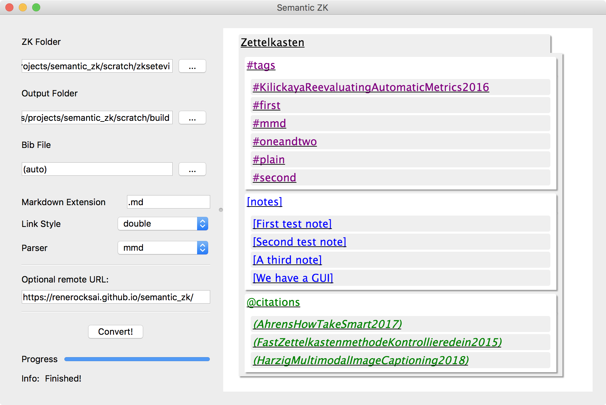
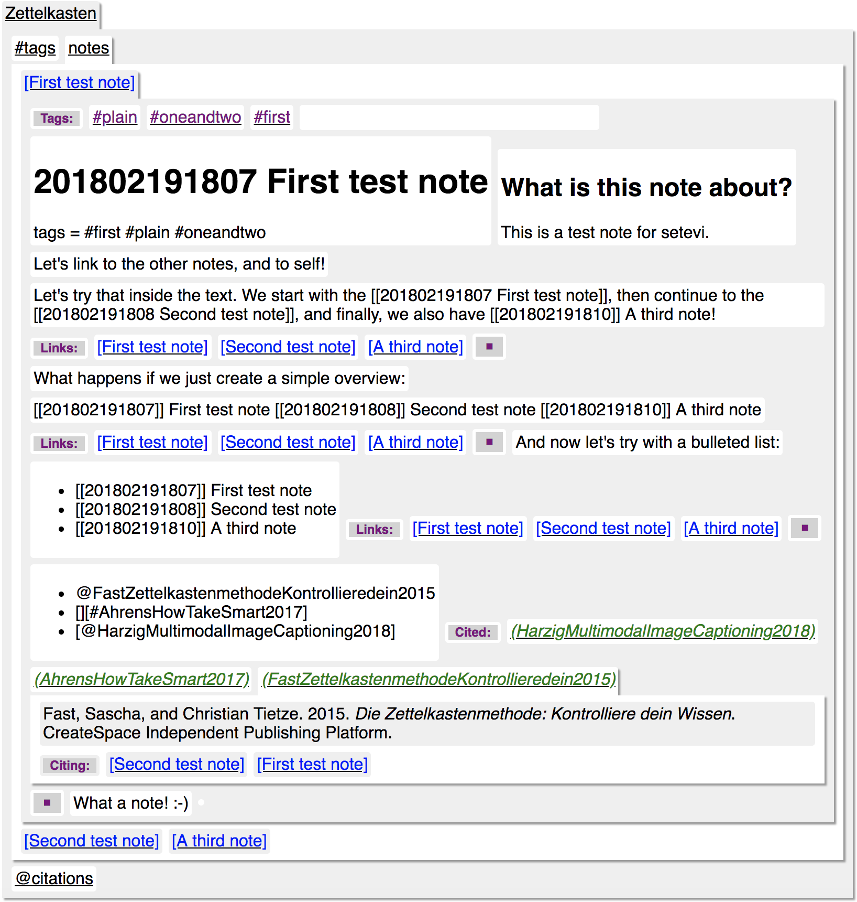

# zk2setevi

Convert Zettelkasten (check out [sublime_zk](https://github.com/renerocksai/sublime_zk), [Zettelkasten.de](https://zettelkasten.de)) to [Setevi](http://felixbenzbaldas.de/setevi/)

This is experimental.

## From:

## To:

## To:

