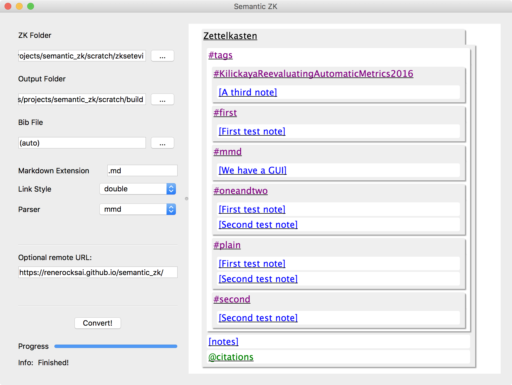
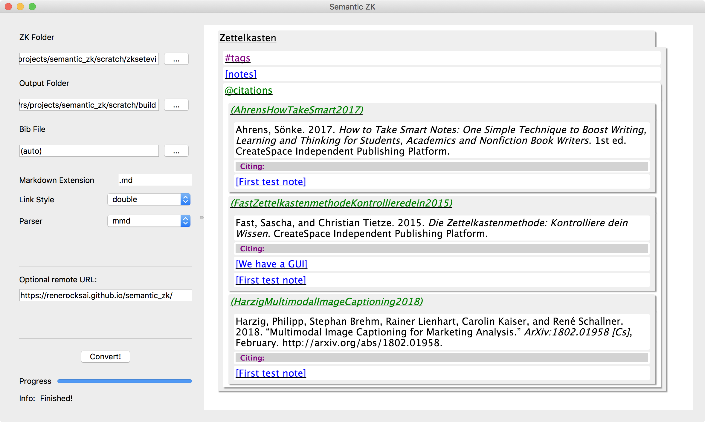
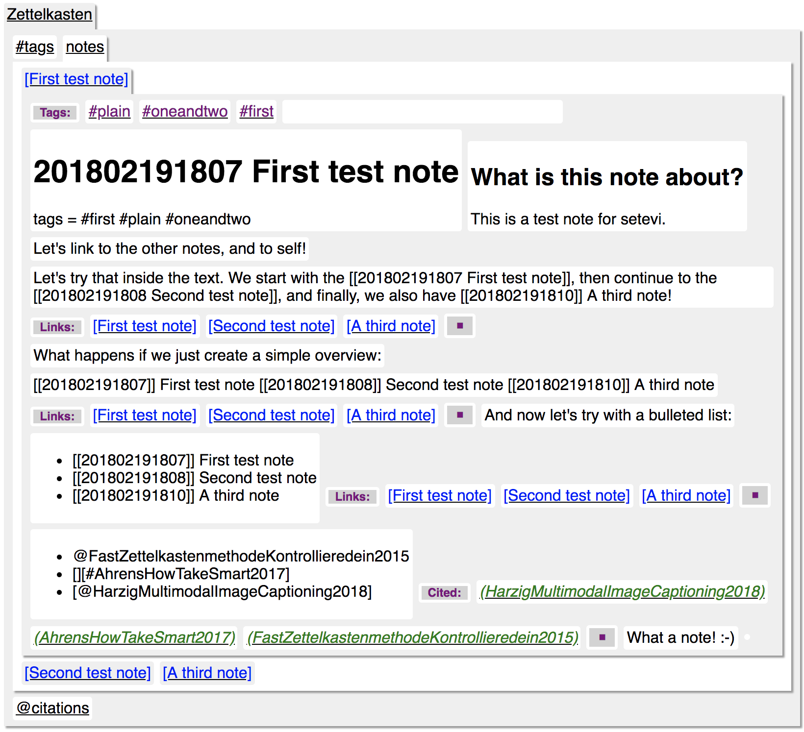
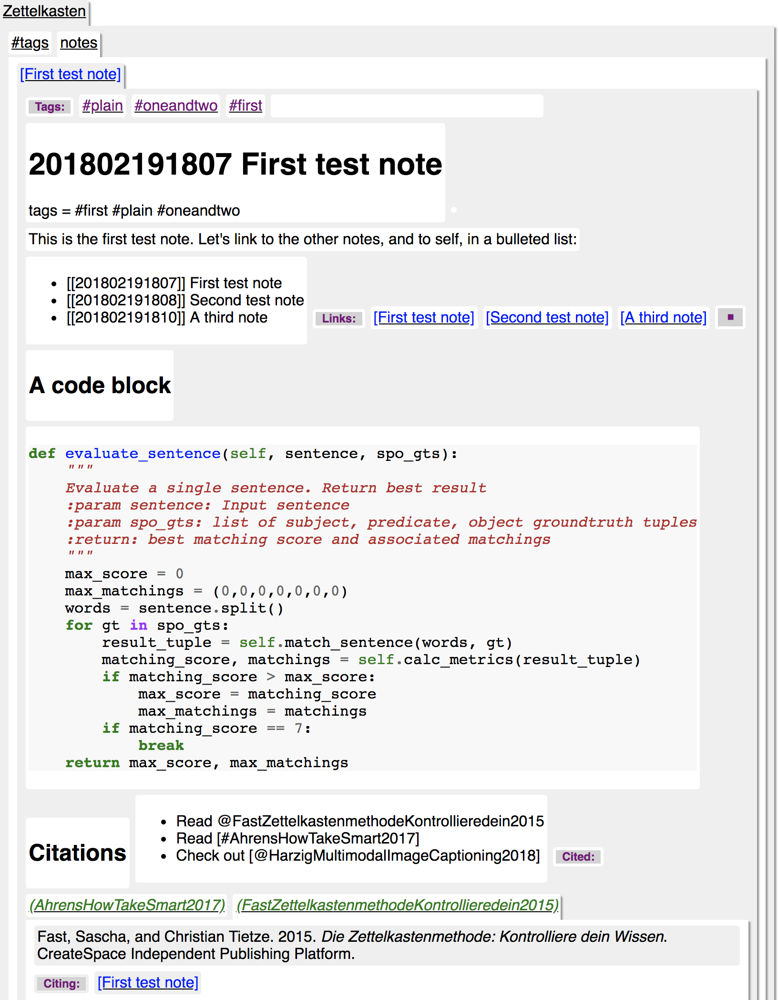
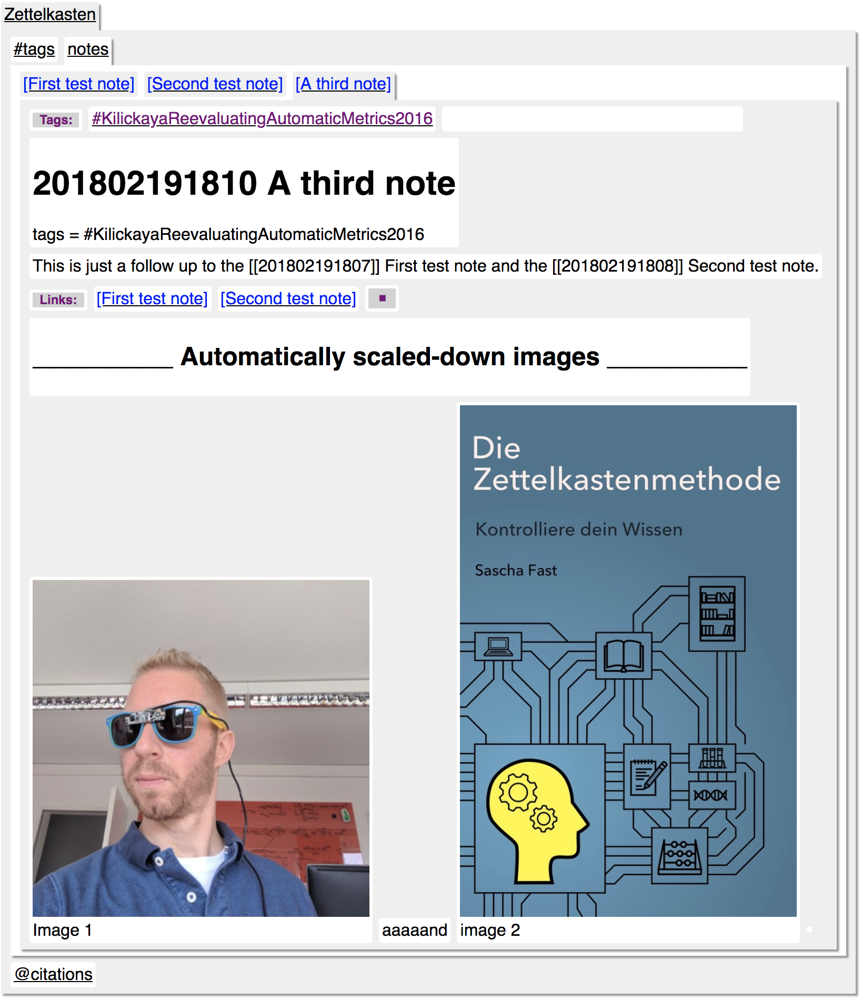
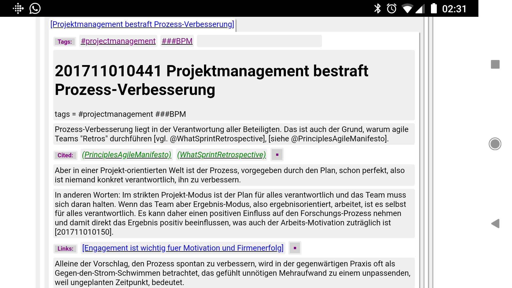

# zk2setevi - The Semantic Text View for your digital Zettelkasten

Convert a Markdown Zettelkasten (check out [sublime_zk](https://github.com/renerocksai/sublime_zk), [Zettelkasten.de](https://zettelkasten.de)) 
to a semantic text view HTML page (see [Setevi](http://felixbenzbaldas.de/setevi/)) that can be viewed with any decent modern browser, even on smartphones :sunglasses:.

The resulting semantic text view features:

* Browsing
    * Notes by title
    * tags: see what notes are tagged with a certain #tag
    * cite keys: see what notes cite a specific source

* Notes
    * show your notes
    * show clickable #tags the note contains
    * show links to expand into linked notes, for each paragraph that contains links.
    * show links to cite keys that expand into the citation's source and also a list of links to notes that also cite that source
    * show fenced code blocks with syntax-coloring
    * show local images, automatically scaled 
    
* tags
    * Are displayed in the #tags overview but also inside each note
    * Clicking on a #tag expands it into a list of tagged notes

* cite keys
    * Are displayed in the @citations overview but also after each paragraph that contains citations.
    * Clicking on a cite key shows the citation's source and also a list of links to notes that also cite that source
    

# ~~~ Under construction ~~~

I'm in the process of putting everything together. There is no graphical tool yet (only command line tool) and there are no releases yet. But they'll be up very very soon.

Better documentation is also in the queue, but for now:

* [Installation](#installation)
* [Usage](#usage)


# Installation

## 3rd party tools

You'll need [pandoc](https://pandoc.org/installing.html) installed (creates citation sources).

## Binary distribution

The [releases](https://https://github.com/renerocksai/zk2setevi/releases) section of the GitHub repository provides binary downloads for up-to-date versions of both Windows 10 and macOs. Each distribution contains both the [command line tool](#command-line-tool) and the [graphical tool](#graphical-tool). There is no installer, the binaries are useable immediately after download.

After installing, go straight to [usage](#usage
)
## From source

Check out this repo, know what you're doing:

### Prerequisites

You'll need:
 
* python3 (I recommend [anaconda](https://www.anaconda.com/download/) with the following modules installed (hint: use pip)
    * pypandoc
    * pymmd
    * markdown
    * pygments

For the [graphical tool](#graphical-tool) you'll also need the following modules:

* PySide

To create standalone executables, you'll also need the following module:

* pyinstaller

### Execution

The [command line tool](#command-line-tool) can be executed like this:

```bash
python zk2setevi.py arguments # (see below)

```

The [graphical tool](#graphical-tool) can be executed like this:

```bash
python zkexport.py
```

### Creating standalone executables

* macOS: `./make_exe.sh`
* win10: `make_exe.cmd`

Then check the `dist` folder.

Note that you'll need a pathched version of `pymmd` for win10:


```python

# TODO: patch goes here

```


# Usage

## About the available parsers

This tool provides/uses 3 different markdown parsers:

* native: the fastest but least capable parser
    * handles pandoc and multimarkdown citations
    * handles pandoc and multimarkdown style fenced code blocks with syntax coloring
    * no tables
    * supports images
* multimarkdown (default): fast parser, should always be used
    * handles pandoc and multimarkdown citations
    * handles pandoc and multimarkdown style fenced code blocks with syntax coloring
    * handles multimarkdown tables
    * supports images
* pandoc: slow parser but can handle pandoc markdown
    * handles pandoc and multimarkdown citations
    * handles pandoc and multimarkdown style fenced code blocks with syntax coloring
    * handles multimarkdown tables
    * **handles pandoc tables**
    * supports images

You should always use the default mmd parser, even if your text uses pandoc syntax.

The only exception is: If your text contains pandoc style tables, then go for the pandoc parser. Pandoc `[@citations]` and pandoc `~~~fenced cod blocks~~~` will be converted internally automatically by the tool, so that the multimarkdown parser can handle them.

## Command Line Tool

```bash
usage: zk2setevi.py [-h] [-b FILE] [-e EXTENSION] [-l {single,double,§}]
                    [-p PARSER] [-w MAX_IMG_WIDTH]
                    input_folder output_folder

Convert a Zettelkasten into a Setevi HTML page

positional arguments:
  input_folder          Input: your Zettelkasten folder
  output_folder         Output: Folder to write output HTML to

optional arguments:
  -h, --help            show this help message and exit
  -b FILE, --bibfile FILE
                        .bib file to use for citations if none is in your
                        Zettelkasten folder (default: None)
  -e EXTENSION, --extension EXTENSION
                        extension of your markdown files (default: .md)
  -l {single,double,§}, --linkstyle {single,double,§}
                        link style: double=[[link]], single=[link], §=§link
                        (default: double)
  -p PARSER, --parser PARSER
                        markdown parser: mmd=internal Multimarkdown,
                        pandoc=pandoc, native=native (default: mmd)
```

## Graphical Tool

```python
# TODO: write this
```


# Screenshots of a Semantic Text View

## From something like this:


## To:


## Tags:



## Citations:



## Notes:



## Open citation and code block in note


## Tables


## Images :-)



## Zettelkasten on Android :sunglasses:



