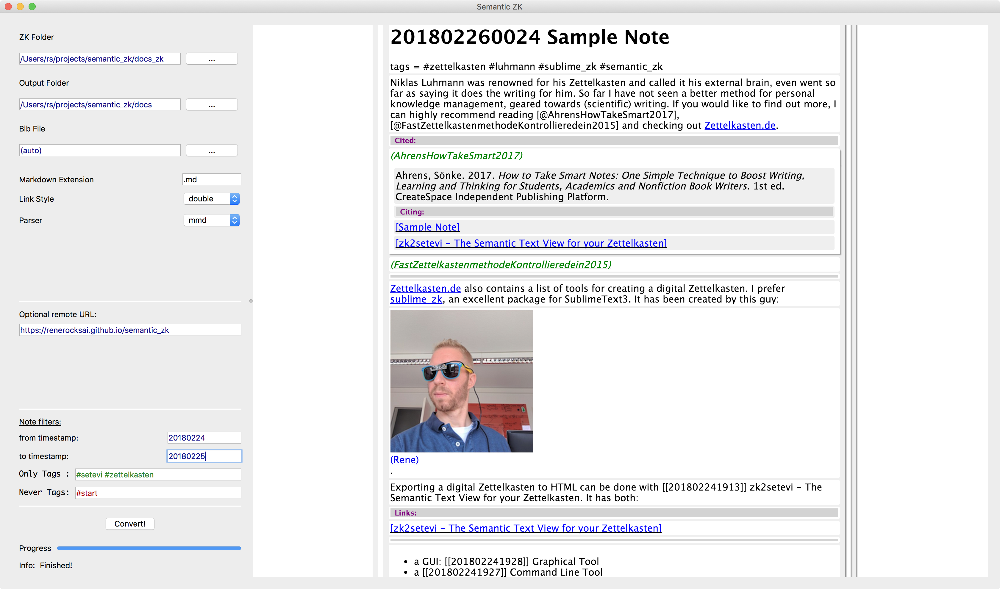
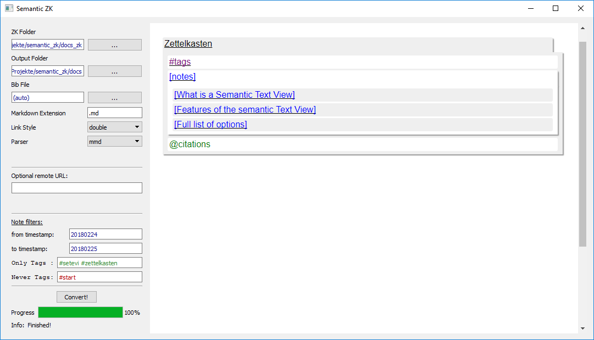
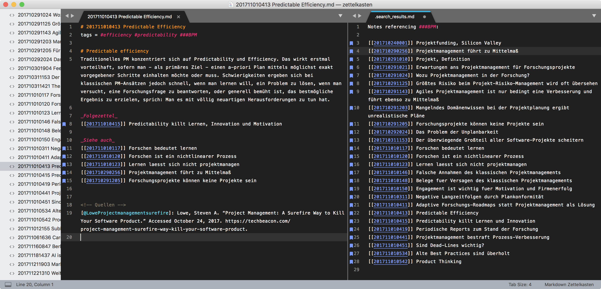
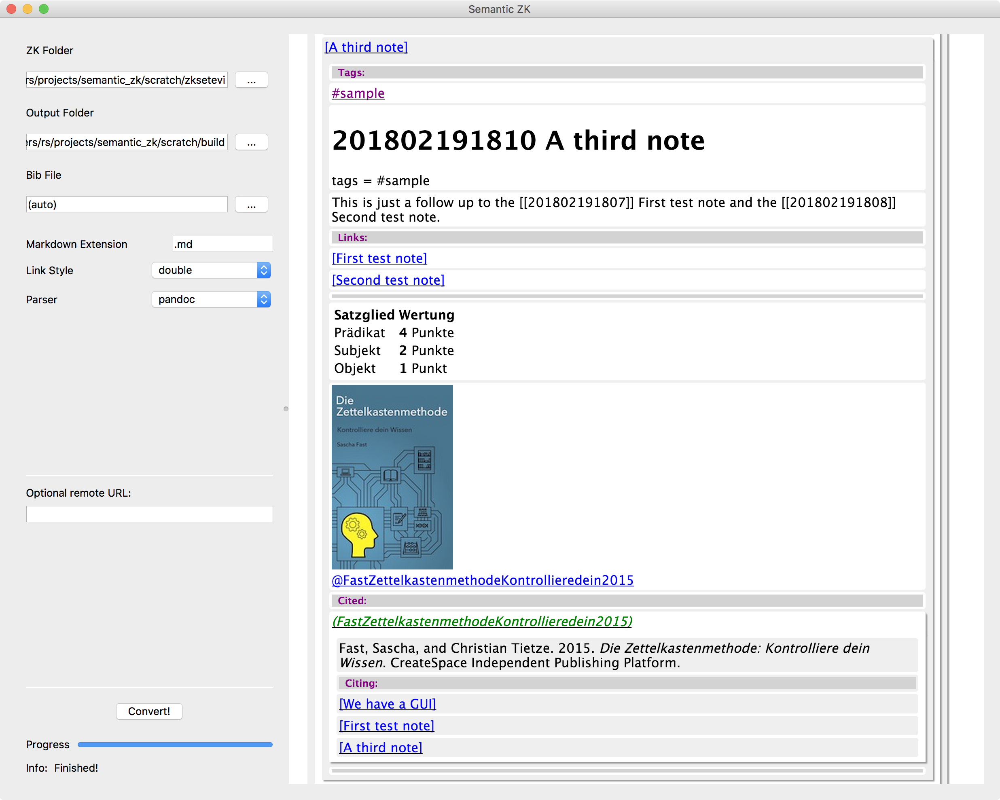

# Semantic_ZK - The Semantic Text View for your Zettelkasten



Convert a Markdown Zettelkasten (check out [sublime_zk](https://github.com/renerocksai/sublime_zk), [Zettelkasten.de](https://zettelkasten.de)) 
to a semantic text view HTML page (see [Setevi](http://felixbenzbaldas.de/setevi/)) that can be viewed with any decent modern browser, even on smartphones :sunglasses:.

The resulting semantic text view features:

* Browsing
    * Notes by title
    * tags: see what notes are tagged with a certain #tag
    * cite keys: see what notes cite a specific source

* Notes
    * show your notes
    * show clickable #tags the note contains
    * show links to expand into linked notes, for each paragraph that contains links.
    * show links to cite keys that expand into the citation's source and also a list of links to notes that also cite that source
    * show fenced code blocks with syntax-coloring
    * show local images, automatically scaled 
    
* tags
    * Are displayed in the #tags overview but also inside each note
    * Clicking on a #tag expands it into a list of tagged notes

* cite keys
    * Are displayed in the @citations overview but also after each paragraph that contains citations.
    * Clicking on a cite key shows the citation's source and also a list of links to notes that also cite that source
    
# See it in action!

Semantic_ZK is documented in Zettelkasten style and has converted its own documentation :smile:.

See it in action [here](https://renerocksai.github.io/semantic_zk/)!

# ~~~ Under construction ~~~

Better documentation is also in the queue, but for now:

* [Installation](#installation)
* [Usage](#usage)


# Installation

## 3rd party tools

You'll need [pandoc](https://pandoc.org/installing.html) installed (creates citation sources).

## Binary distribution

The [releases](https://https://github.com/renerocksai/zk2setevi/releases) section of the GitHub repository provides binary downloads for up-to-date versions of both Windows 10 and macOs. Each distribution contains both the [command line tool](#command-line-tool) and the [graphical tool](#graphical-tool). 

There is no installer, the binaries are useable immediately after download and unzipping.


After installing, go straight to [usage](#usage
)
## From source

Check out this repo, know what you're doing:

### Prerequisites

You'll need:
 
* python3 (I recommend [anaconda](https://www.anaconda.com/download/) with the following modules installed (hint: use pip)
    * pypandoc
    * pymmd
    * markdown
    * pygments
    * PyQt5


### Execution

The [command line tool](#command-line-tool) `zk2setevi` can be executed like this:

```bash
python zk2setevi.py arguments # (see below)

```

The [graphical tool](#graphical-tool)`semantic_zk` can be executed like this:

```bash
python semantic_zk.py
```


# Usage

## About the available parsers

This tool provides/uses 3 different markdown parsers:

* native: the fastest but least capable parser
    * handles pandoc and multimarkdown citations
    * handles pandoc and multimarkdown style fenced code blocks with syntax coloring
    * no tables
    * supports images
* multimarkdown (default): fast parser, should always be used
    * handles pandoc and multimarkdown citations
    * handles pandoc and multimarkdown style fenced code blocks with syntax coloring
    * handles multimarkdown tables
    * supports images
* pandoc: slow parser but can handle pandoc markdown
    * handles pandoc and multimarkdown citations
    * handles pandoc and multimarkdown style fenced code blocks with syntax coloring
    * handles multimarkdown tables
    * **handles pandoc tables**
    * supports images

You should always use the default mmd parser, even if your text uses pandoc syntax.

The only exception is: If your text contains pandoc style tables, then go for the pandoc parser. Pandoc `[@citations]` and pandoc `~~~fenced cod blocks~~~` will be converted internally automatically by the tool, so that the multimarkdown parser can handle them.

## Command Line Tool

The command line tool is named `zk2setevi`.

### Default Conversion

Due to reasonable defaults, a typical invocation looks like this:

```bash
./zk2setevi /path/to/zettelkasten /path/to/output_directory
```

**Note:** The output directory must already exist. 

If you want to use the `pandoc` parser, type

```bash
./zk2setevi /path/to/zettelkasten /path/to/output_directory -p pandoc
```

### Note Filtering

If you only want to convert parts of your Zettelkasten, this tool supports the following filters that can be **combined** as you please:

* only notes from a given date or older
* only notes up to a given date but not older
* only notes containing certain tags
* never notes containing certain tags

The full list of available options is displayed on the usage screen:

```bash
usage: zk2setevi    [-h] [-b FILE] [-e EXTENSION] [-l {single,double,§}]
                    [-p PARSER] [-u BASEURL] [--from FROM] [--to TO]
                    [--only-tags ONLY_TAGLIST] [--never-tags NEVER_TAGLIST]
                    input_folder output_folder

Convert a Zettelkasten into a Setevi HTML page

positional arguments:
  input_folder          Input: your Zettelkasten folder
  output_folder         Output: Folder to write output HTML to

optional arguments:
  -h, --help            show this help message and exit
  -b FILE, --bibfile FILE
                        .bib file to use for citations if none is in your
                        Zettelkasten folder (default: None)
  -e EXTENSION, --extension EXTENSION
                        extension of your markdown files (default: .md)
  -l {single,double,§}, --linkstyle {single,double,§}
                        link style: double=[[link]], single=[link], §=§link
                        (default: double)
  -p PARSER, --parser PARSER
                        markdown parser: mmd=internal Multimarkdown,
                        pandoc=pandoc, native=native (default: mmd)
  -u BASEURL, --url BASEURL
                        Remote URL the HTML should be built for (default: )
  --from FROM           (optionally abbreviated) timestamp from: include only
                        notes that are not younger than FROM (default:
                        19000101)
  --to TO               (optionally abbreviated) timestamp to: include only
                        notes that are not older than TO (default: 22001231)
  --only-tags ONLY_TAGLIST
                        only include notes tagged with tags from ONLY_TAGLIST
                        (default: )
  --never-tags NEVER_TAGLIST
                        never include notes tagged with tags from ONLY_TAGLIST
                        (default: )
```

### Example:

```bash
docs_zk docs --only-tags='#setevi #zettelkasten' --never-tags=#start \
             --from 20180224 --to=20180225 
```

* convert the `docs_zk` folder
* write output to the `docs` folder
* only consider notes tagged with either `#setevi` or `#zettelkasten`
* never consider notes tagged with `#start`
* only consider notes from 2018-02-24 to 2018-02-25 (incl.)


## Graphical Tool

The Graphical tool `semantic_zk` is pretty self-explanatory:



The typical workflow is:

* 1: Select Zettelkasten folder
* 2: Select Output folder
* 12: Convert

When the conversion is finished, the generated HTML will be rendered on the right half of the window.

Once you close the program, you can always just open the HTML in a browser from your chosen output folder, to see it again.

The optional steps are:

* 3: Select a `.bib` file if there is none in your Zettelkasten folder or if you want to override it.
* 4: Enter the filename extension of your markdown files if it differs from `.md`, for example `.mdown` or `.txt`.
* 5: Select the link style format that should be used in the HTML output. 
    * Default is `[double` for `[[double bracket links]]` 
    * `single` stands for `[single bracket links]`
    * `§` selects `§201802240300` old school links 
* 6: select a markdown parser. See [above](#about-the-available-parsers) for a comparison:
    * Default is `mmd`, the Multimarkdown parser
    * `pandoc` stands for the Pandoc parser
    * `native` selects the native parser
* 7 : Specify the remote URL if the export is meant to be uploaded to a webserver. This fixes the image links. Leave blank for local use.
* 8 : Specify the (optionally abbreviated) **from** timestamp: include only notes that are not younger than the given timestamp
* 9 : Specify the (optionally abbreviated) **to** timestamp: include only notes that are not older than the given timestamp
* 10: Enter a list of tags in `#tag1 #tag2` format to **only** include notes that are tagged by either of the given tags.
* 11: Enter a list of tags in `#tag1 #tag2` format to **never** include notes that are tagged by either of the given tags.

# Screenshots of a Semantic Text View

## From something like this:



## To:


## Tags:


## Citations:


## Notes:


## Sample Note:



## Zettelkasten on Android :sunglasses:


