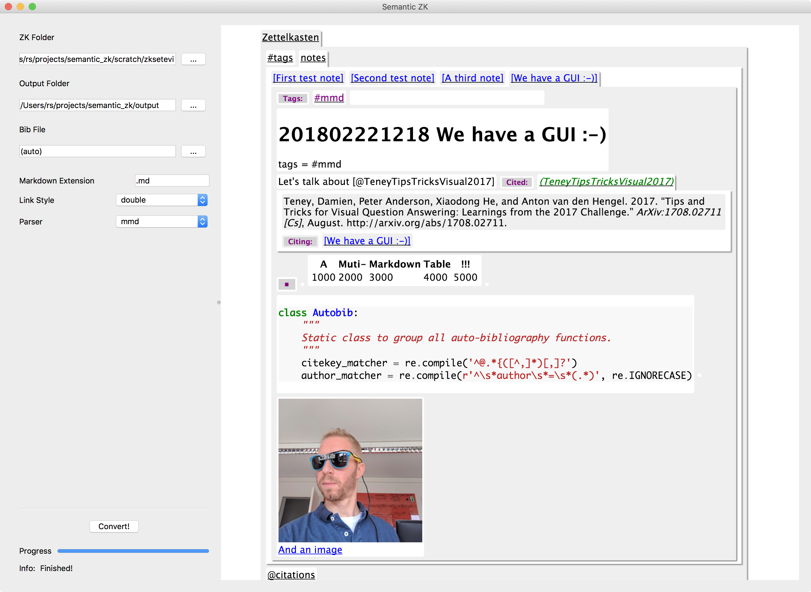

# 201802241913 zk2setevi - The Semantic Text View for your Zettelkasten
tags = #start #setevi #zettelkasten #0-start

This is a tool to convert a Markdown Zettelkasten (see [Zettelkasten.de](https://zettelkasten.de)) into a semantic text view HTML page (see [Setevi](http://felixbenzbaldas.de/setevi/)) that can be viewed with any decent modern browser, even on smartphones :-). #mobile #android

These pages have been authored with [sublime_zk](https://github.com/renerocksai/sublime_zk), the SublimeText Zettelkasten package.

For more information about the tool, see:

* [[201802241925]] Installation
* [[201802241926]] Usage

### About Semantic Text Views &nbsp;&nbsp;&nbsp;&nbsp;&nbsp;&nbsp;&nbsp;&nbsp;&nbsp;&nbsp;&nbsp;&nbsp;&nbsp;&nbsp;&nbsp;&nbsp;&nbsp;&nbsp;&nbsp;&nbsp;&nbsp;&nbsp;&nbsp;&nbsp;&nbsp;&nbsp;&nbsp;&nbsp;&nbsp;&nbsp;&nbsp;&nbsp;&nbsp;&nbsp;&nbsp;&nbsp;&nbsp;&nbsp;&nbsp;&nbsp;&nbsp;&nbsp;&nbsp;&nbsp;&nbsp;&nbsp;&nbsp;&nbsp;&nbsp;&nbsp;&nbsp;&nbsp;

* [[201802241917]] What is a Semantic Text View
* [[201802241918]] Features of the semantic Text View

### Interesting Zettelkasten-Books

* [@AhrensHowTakeSmart2017] available in English and German, also as e-book.
* [@FastZettelkastenmethodeKontrollieredein2015] available in German on paper.

