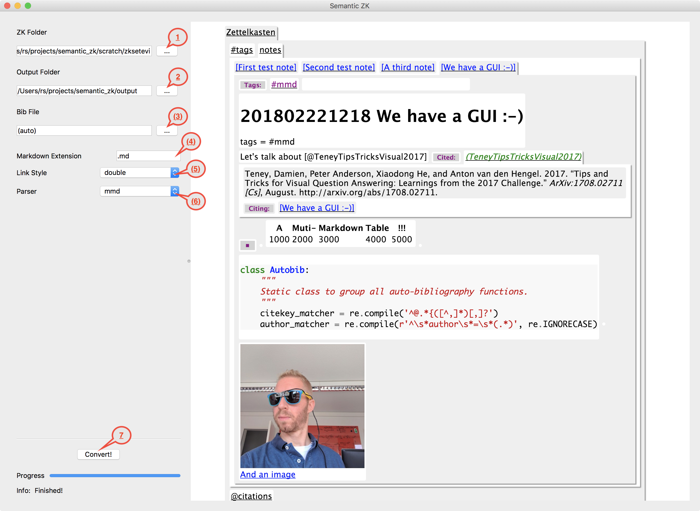

# 201802241928 Graphical Tool
tags = #graphical #usage #gui

The Graphical tool `semantic_zk` is pretty self-explanatory:

The typical workflow is:

* 1: Select Zettelkasten folder
* 2: Select Output folder
* 7: Convert

When the conversion is finished, the generated HTML will be rendered on the right half of the window.

Once you close the program, you can always just open the HTML in a browser from your chosen output folder, to see it again.

The optional steps are:

* (3): Select a `.bib` file if there is none in your Zettelkasten folder or if you want to override it.
* (4): Enter the filename extension of your markdown files if it differs from `.md`, for example `.mdown` or `.txt`.
* (5): Select the link style format that should be used in the HTML output.
    * Default is `double` for `[[double bracket links]]`
    * `single` stands for `[single bracket links]`
    * `§` selects `§201402241928` old school links
* (6): select a markdown parser. See the note [[201802241932]] on available parsers for a comparison:
    * Default is `mmd`, the Multimarkdown parser
    * `pandoc` stands for the Pandoc parser
    * `native` selects the native parser

