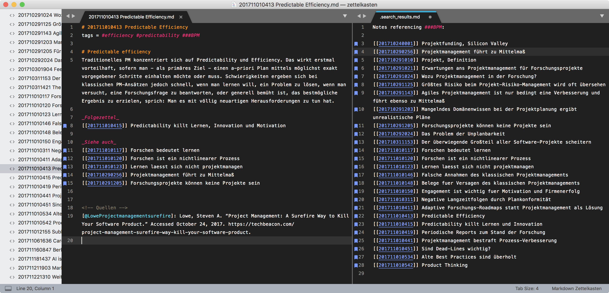
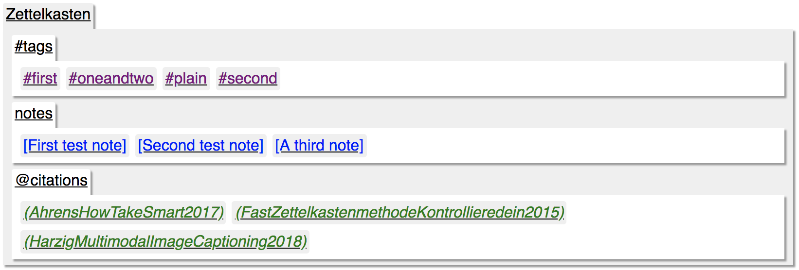
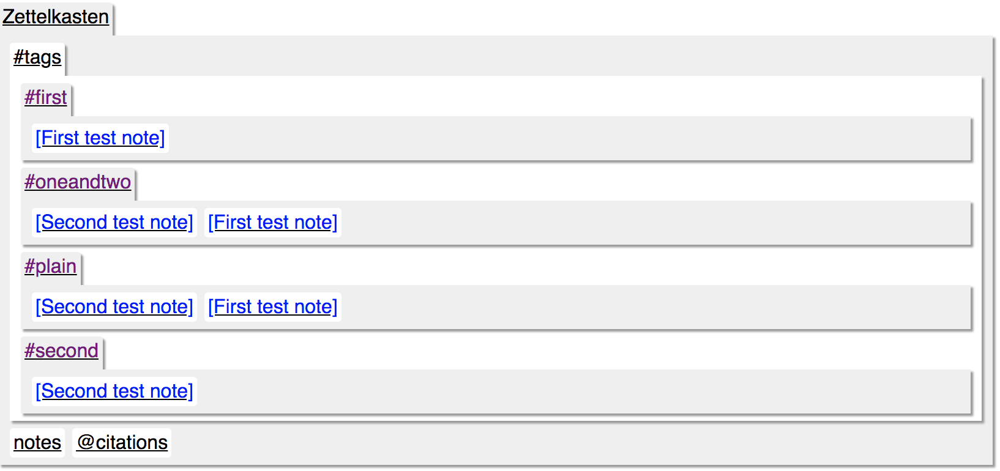
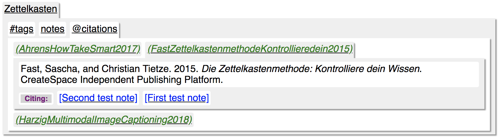
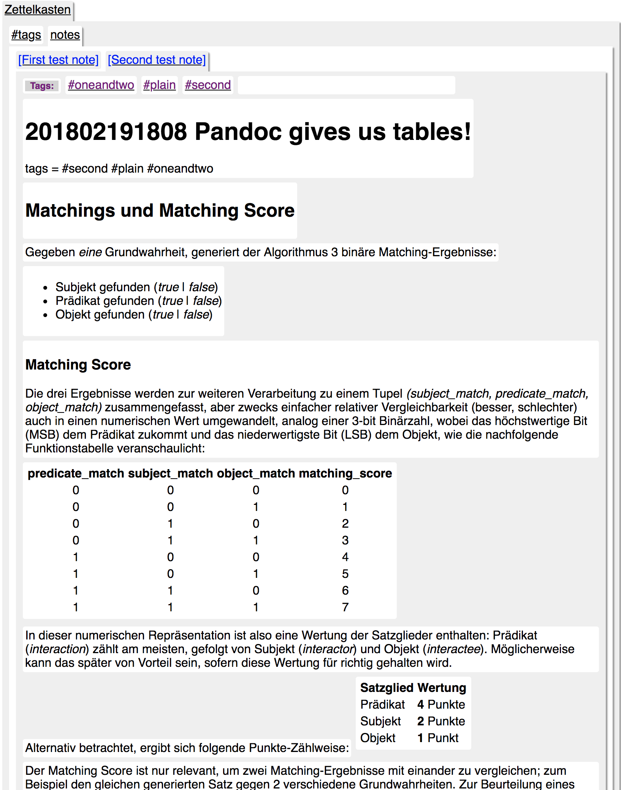
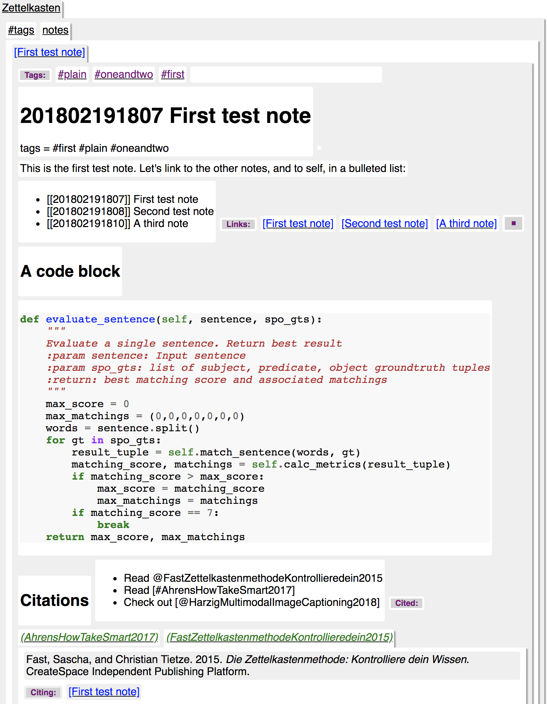

# 201802241939 Screen-Shots
tags = #usage  #setevi  #zettelkasten #features #mobile #android

## From something like this:

## To:

## Tags:

## Citations:

## Notes:

## Expanding Note Links

## Open citation and code block in note

## Images :-)

## Zettelkasten on Android :sunglasses:

